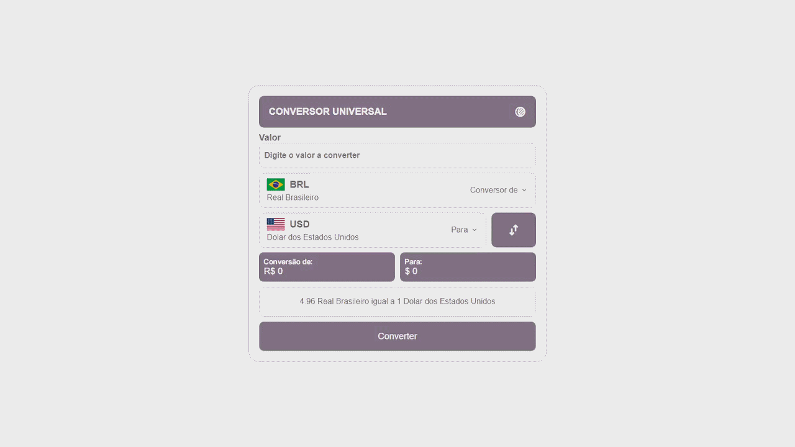

# 🧮 Conversor universal de moeda

> Este é um projeto desenvolvido com o objetivo de aprimorar meus conhecimentos em JavaScript, com foco no consumo de APIs, manipulação de eventos e estruturação de dados utilizando JSON.

---
## 📌 Sobre o projeto

> O Conversor Universal de Moedas é uma aplicação web que permite converter valores entre diferentes moedas de forma prática e dinâmica. As taxas de conversão são obtidas em tempo real por meio de uma API externa, garantindo resultados atualizados.

> Durante o desenvolvimento deste projeto, busquei colocar em prática conceitos fundamentais do JavaScript, enfrentando desafios que contribuíram diretamente para a evolução da minha lógica de programação e entendimento sobre integração com serviços externos.

---
## 💡 Desafios enfrentados

> Confesso que o desenvolvimento não foi simples. Durante o processo, enfrentei dificuldades principalmente na integração com a API e no tratamento dos dados retornados. No entanto, cada obstáculo superado contribuiu para um aprendizado mais sólido e uma evolução significativa nas minhas habilidades.

---

## 🚀 Tecnologias utilizadas

* HTML5
* CSS3
* JavaScript
* APIs de câmbio (exchange rates)

---

## 🎯 Funcionalidades

* [ ] Conversão entre diferentes moedas
* [ ] Atualização automática das taxas de câmbio
* [ ] Interface simples e intuitiva
* [ ] Entrada de valores personalizada pelo usuário
* [ ] Seleção de moedas de origem e destino
---

## ▶️ Como executar

```bash
# Clone o repositório
git clone https://github.com/ryanconceicao45-boop/calculadora
# Abra o index.html no navegador
```

---

## 📸 Preview



---

## 👨‍💻 Autor

**RYAN DA CONCEIÇÃO BARBOSA**

* LinkedIn: https://www.linkedin.com/in/ryan-concei%C3%A7%C3%A3o-132404283/

---

## 📄 Licença
Este projeto está sob a licença MIT.