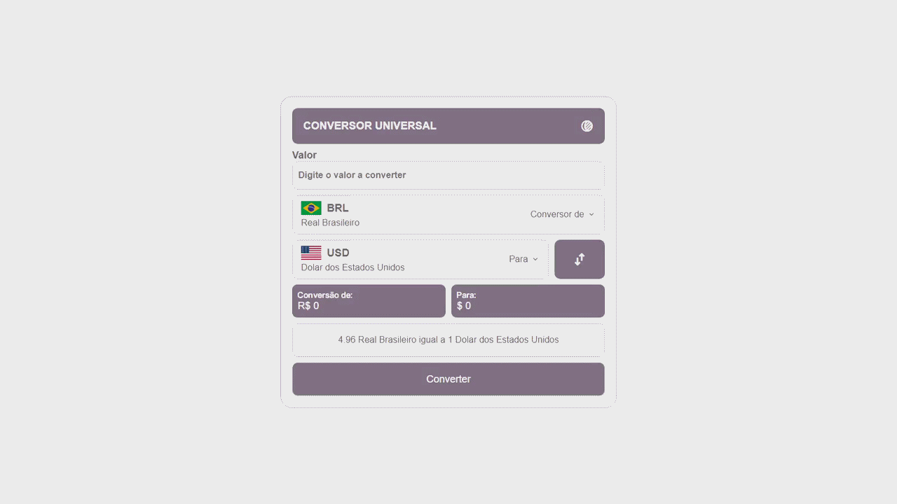

### 🧮 Conversor universal de moeda

> Este é um projeto desenvolvido com o objetivo de aprimorar meus conhecimentos em JavaScript, com foco no consumo de APIs, manipulação de eventos e estruturação de dados utilizando JSON.

### 📌 Sobre o projeto

> O Conversor Universal de Moedas é uma aplicação web que permite converter valores entre diferentes moedas de forma prática e dinâmica. As taxas de conversão são obtidas em tempo real por meio de uma API externa, garantindo resultados atualizados.

> Durante o desenvolvimento deste projeto, busquei colocar em prática conceitos fundamentais do JavaScript, enfrentando desafios que contribuíram diretamente para a evolução da minha lógica de programação e entendimento sobre integração com serviços externos.

---

### 🚀 Tecnologias utilizadas

  
  
  
  

---

### 🎯 Funcionalidades

* [ ] Conversão entre diferentes moedas
* [ ] Atualização automática das taxas de câmbio
* [ ] Interface simples e intuitiva
* [ ] Entrada de valores personalizada pelo usuário
* [ ] Seleção de moedas de origem e destino

---
### 💡 Aprendizados
Durante o desenvolvimento deste projeto foram praticados conceitos como:

* [ ] Consumo de APIs
* [ ] Manipulação do DOM
* [ ] Eventos
* [ ] Funções
* [ ] Arrays e Objetos
* [ ] Async/Await
* [ ] Tratamento de dados JSON
* [ ] Formatação de moedas
* [ ] Responsividade
* [ ] Organização de código
* [ ] Lógica de programação
* [ ] Integração com serviços externos
---

### 📸 Preview

---

### 👨‍💻 Autor

**RYAN DA CONCEIÇÃO BARBOSA**
 
LinkedIn: https://www.linkedin.com/in/ryan-concei%C3%A7%C3%A3o-132404283/

---

### 📄 Licença
⭐ Este projeto está sob a licença MIT.
 
⭐ Se gostou do projeto, considere deixar uma estrela no repositório.

---

banner: https://ik.imagekit.io/ubdczxve6/converty.jpg?updatedAt=1781797979742
